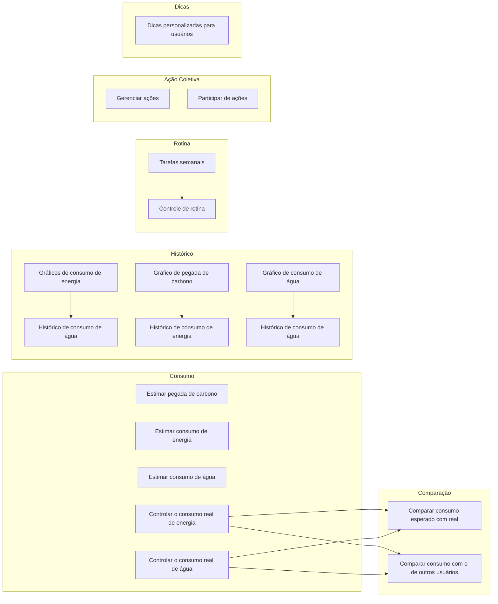
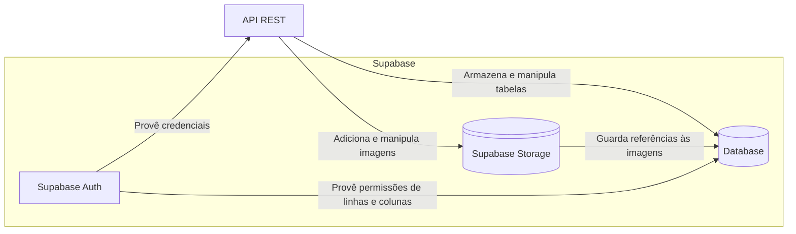
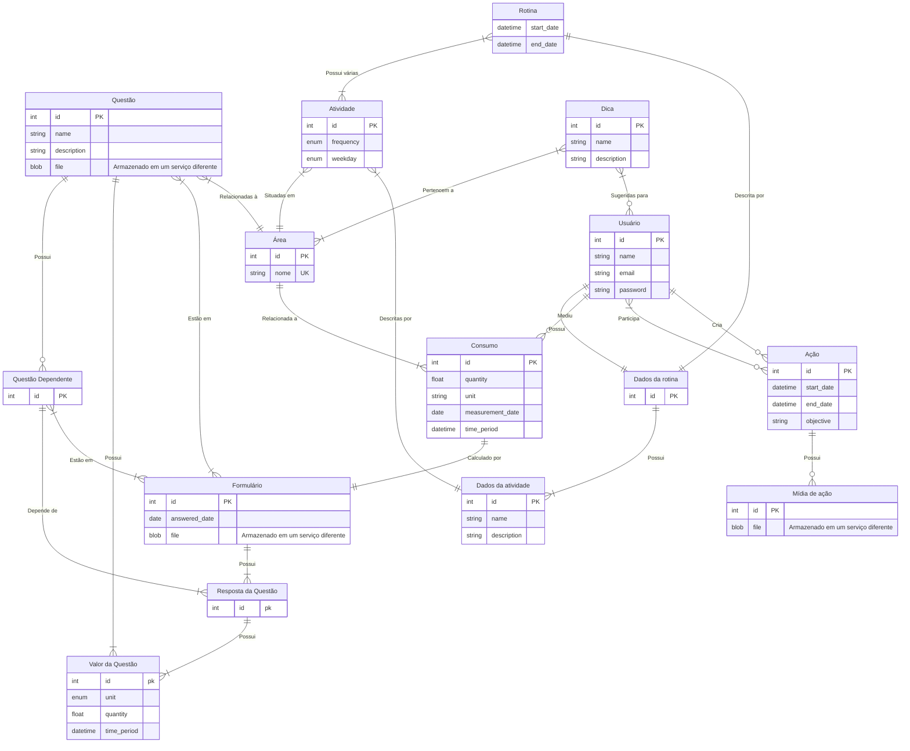
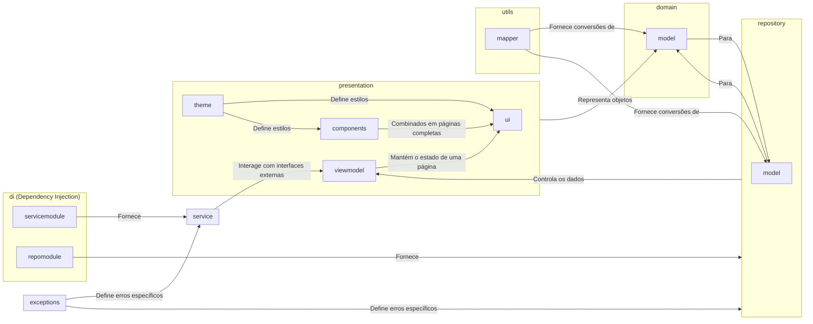

# Arquitetura e tecnologias

A arquitetura da aplicação é similar a de outros projetos que utilizam uma estrutura de diretórios baseados em Clean Architecture, mas a arquitetura seguida é a Model-View-ViewModel (MVVM), com distinções em subcamadas para os modelos. No lado do servidor, a arquitetura é monolítica, com um único banco de dados e acesso centralizado aos serviços de autenticação, armazenamento e etc.

Já as tecnologias utilizadas foram escolhidas com base nas seguintes restrições de domínio e de recursos:

- **Tempo limitado**: por isso utilizamos bibliotecas de interface de usuário com componentes e Design System já estruturados, e também utilizamos plataformas de BaaS (Back-End as a Service) para maior foco no desenvolvimento da aplicação móvel.
- **Relacionamento complexo entre entidades**: com agrupamento de múltiplas entidades por uma área temática, além da presença de formulários reutilizáveis em diferentes contextos, o que faz necessário que uma mesma alternativa de uma questão tenha diferentes valores para cada contexto.
- **Presença de dados que necessitam de atualizações assíncronas**: entre as funcionalidades descritas nas [Histórias de Usuário](software-requirements-specification.md) estão dicas personalizadas para usuários e rotinas semanais. Pensando na escalabilidade, uso em diferentes plataformas e experiência de usuário, existe a necessidade que atualizações nesses dados ocorram de forma assíncrona no lado do servidor.

#### Agrupamento de Funcionalidades

As principais funcionalidades da aplicação, definidas nas [Histórias de Usuário](software-requirements-specification.md) se dividem nos seguintes temas:

### Back-End

### Banco de dados

### Aplicação Mobile

O principal produto consiste de uma aplicação móvel nativa para Android. Essa aplicação atua como cliente do servidor descrito acima. Essa aplicação está sendo desenvolvida com a linguagem Kotlin, que é atualmente a recomendação da Google para o desenvolvimento Android. Abaixo estão incluídas descrições detalhadas das camadas da aplicação, da comunicação entre elas e as bibliotecas utilizadas em cada uma.

#### Camadas

### Tecnologias

#### Interface de Usuário (presentation)

A interface de usuário é criada com a biblioteca Jetpack Compose e outros pacotes auxiliares (e.g. navigation-compose), seguindo os padrões do Material 3. As telas completas são definidas no pacote subpacote `ui` e componentes individuais em `components` . O tema de cores foi criado com o plugin Material Theme Builder do Figma e é definido subpacote `theme`.

Dentro do subpacote `viewmodel` estão os ViewModels, responsáveis por armazenar os dados da tela e encapsular o contato destas com serviços e repositórios. Idealmente, cada tela está vinculada a um único ViewModel.

#### Serviços (service)

Os serviços são interfaces externas utilizadas pelo sistema, como autenticação e notificações, podem ser acessados por interfaces de Rede, como HTTP, ou por serviços do Android (Foreground, Background, Broadcast, etc).

Um serviço pode ser utilizado diretamente por um ViewModel, como no caso da autenticação, em que o estado do login e as ações realizadas são repassadas da interação do usuário para o ViewModel e depois para um serviço específico.

Atualmente, os serviços utilizados estão presentes no [Supabase](https://supabase.com), sendo a  autenticação o principal.

#### Repositórios (repository)

A camada de repositório é responsável por interfaces externas que representam/integram bancos de dados, como bancos de dados locais ou operações CRUD acessadas por APIs REST. No momento, a interface de banco de dados planejada será acessada através da API REST do Supbase, consumida através do Retrofit.

No subpacote `model` estão modelos específicos de uma implementação de banco de dados, que necessitam de conversão para modelos do domínio.

#### Utilitários (utils)

A camada de utilitários é compartilhada através de outras e é usada principalmente para processamentos locais ou mapeamento de entidades, no subpacote `mapper` estão as interfaces e classes responsáveis por converter modelos do domínio para modelos de outras camadas bidirecionalmente.

A serialização de objetos será implementada com a biblioteca Moshi e é utilizada nesse mapeamento, nos casos em que um objeto precise ser enviado em um formato JSON.

#### Injeção de Dependência (di)

A injeção de dependência na aplicação é gerenciada com a biblioteca Hilt, onde os módulos (objetos Kotlin) contendo os métodos para retornar implementações concretas das interfaces são definidos por camada, então todas as injeções da camada de repositórios estarão em um arquivo `RepositoryModule.kt`, da mesma forma com serviços e outras implementações.
